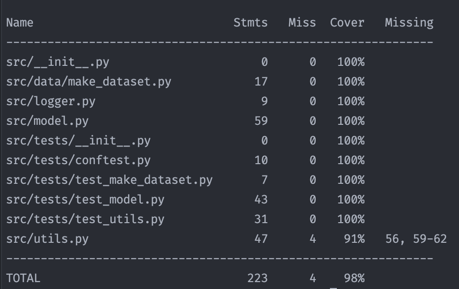

# How to run:

## Downloading

### Download data

Download the data from <a href="https://www.kaggle.com/googleai/pfam-seed-random-split">kaggle</a> and place it in a
folder.
It's expected that the folder structure is as follows:
```--data_dir = "data/random_split"```

```commandline
data
├── random_split
│   ├── dev
│   ├── test
│   ├── train

```

### Download Language Encoder

Download the language encoder from <a href="https://www.kaggle.com/googleai/pfam-seed-random-split">here</a> and place
it in a folder. <br>
```--lang_params = "path/to/lang_params/sample.pickle"```

### Download model checkpoints

Download any model checkpoint and put them in a folder. You can then specify the parameter as follows in scripts. <br>

```commandline
--model_checkpoint = "path/to/model_weights/sample.ckpt"
```

| Models       | Download link | test acc.    |
|--------------|---------------|--------------|
| Row 1 Cell 1 | Row 1 Cell 2  | Row 1 Cell 3 |
| Row 2 Cell 1 | Row 2 Cell 2  | Row 2 Cell 3 |
| Row 3 Cell 1 | Row 3 Cell 2  | Row 3 Cell 3 |

## Run using Docker

### Docker setup.

```docker build . -t instadeep:latest```

### Open docker bash

CPU only: <br>
```docker run --rm -it --entrypoint bash instadeep:latest```

GPU: <br>
```docker run --rm -it --entrypoint bash --gpus=all instadeep:latest```

### Visualize input data

```python src/visualizations/visualize.py --data_dir data/random_split --save_path reports/data_visualizations --partition "train"```

Many other options are available as well, pl see ```python src/visualizations/visualize.py --help```

### Train model

(Note: batch_size needs to be much smaller on CPU (bs=1). To use GPU use the --gpu flag.) <br>
```python src/train.py --batch_size=256```

Many other options are available as well, pl see ```python src/train.py --help```

### Visualize training metrics like loss, accuracy, etc.

```python src/visualizations/visualize_training_vals.py --metrics_file "path/to/file/sample.csv" --save_path "path/to/folder"```

Many other options are available as well, pl see ```python src/visualizations/visualize.py --help```

### Get prediction for a single test sample

```python src/predict.py --input_seq="ABCDE" --model_checkpoint="lightning_logs/version_10/checkpoints/epoch=2-step=12738.ckpt"```

Many other options are available as well, pl see ```python src/predict.py --help```

### Evaluate trained model of test set

```python src/evaluate.py --gpu --model_checkpoint="lightning_logs/version_10/checkpoints/epoch=2-step=12738.ckpt" --test_set_dir="data/random_split/test"```

Many other options are available as well, pl see ```python src/evaluate.py --help```

## Run without docker

(Tested on Python version 3.10.13)

1. Install requirements: ```pip install -r requirements.txt```
2. Export python path:
   ```export PYTHONPATH="${PYTHONPATH}:/Users/pratt/Documents/Instadeep_takehome/"```
3. Run any of the above commands.

# Testing
    
We will be using pytest for this.<br>

```commandline
# Run tests
coverage run -m pytest src/tests.py

# Generate coverage report
coverage report -m
```
Generated Coverage report:<br>



   
## TODO:

1. Add tests.
2. Add logger.
3. Train new model.
4. Create approach explanation pdf.
